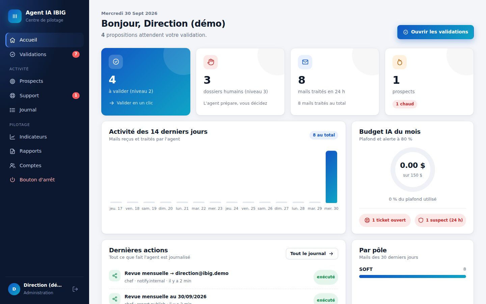
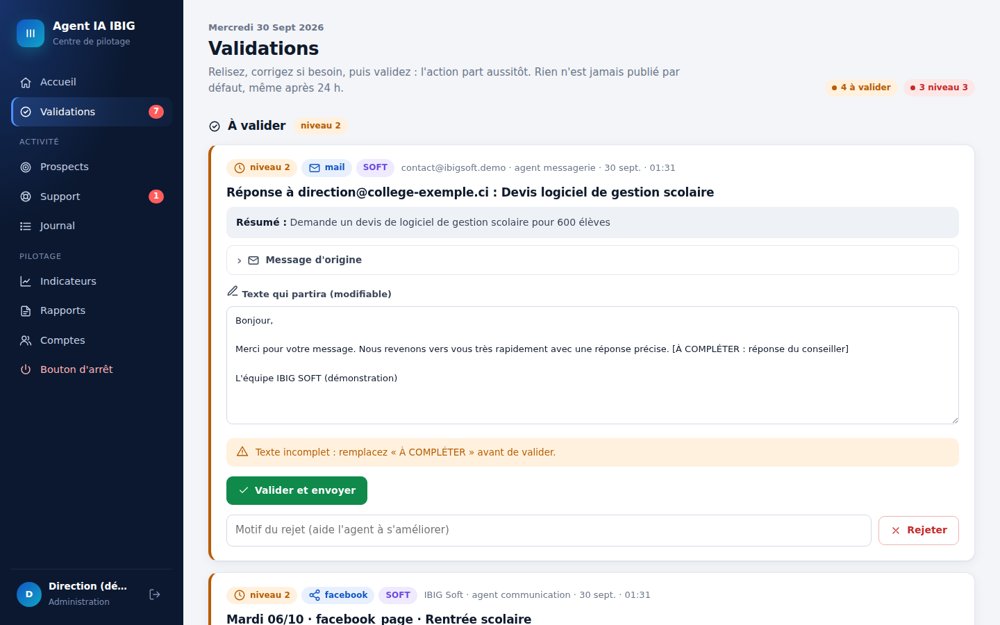
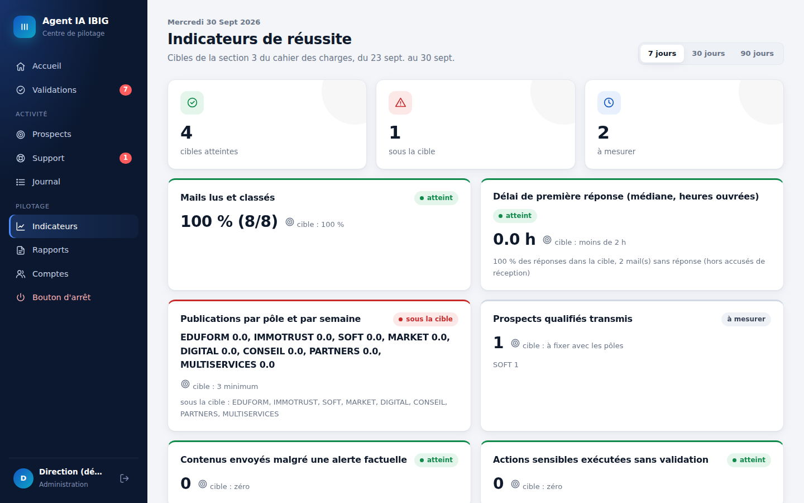
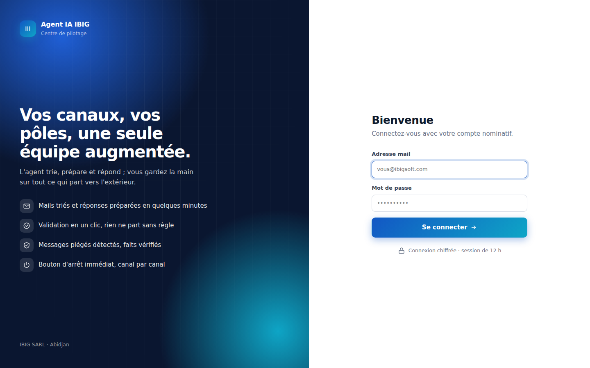
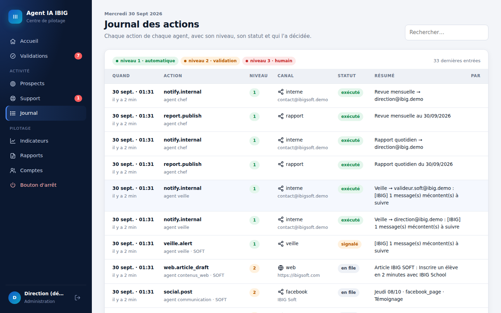
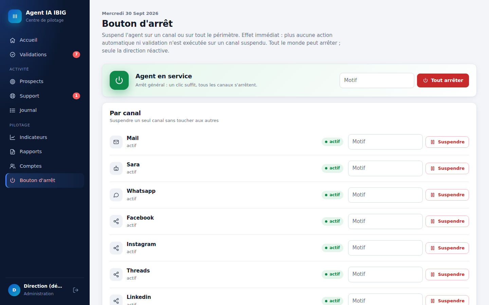
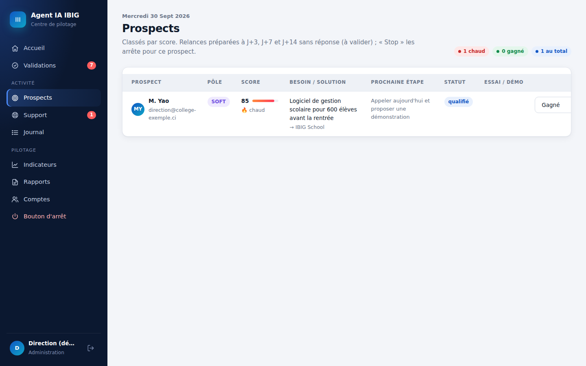
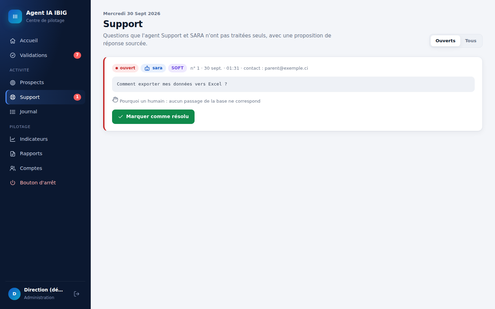
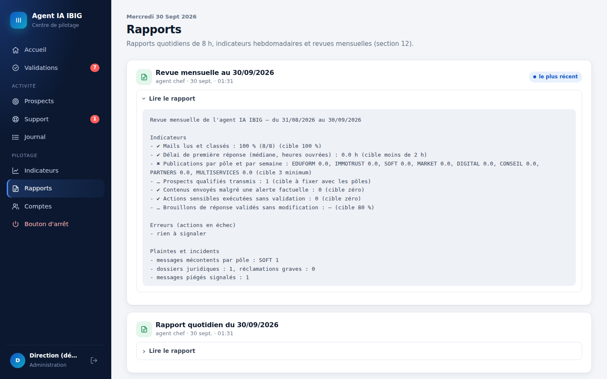

# Agent IA IBIG

Agent IA de communication et d'opérations de l'écosystème **IBIG SARL** — implémentation
du *Cahier des charges — Agent IA IBIG, version 1.0*.

> **Principe directeur** : l'IA prépare et exécute, l'humain valide ce qui engage
> l'entreprise. Les tâches répétitives sont automatiques ; les publications, réponses aux
> clients et campagnes passent par une validation en un clic ; l'argent, les contrats et
> le juridique restent humains.

## Où en est-on ?

Ce dépôt contient le **socle de la phase 1** (tri et réponse aux mails Gmail + LWS) et le
début de la phase 2 (calendrier éditorial). Détail et suite : [`docs/feuille-de-route.md`](docs/feuille-de-route.md).

| Brique | État |
|---|---|
| Gouvernance 3 niveaux, journal complet, bouton d'arrêt | ✅ |
| Agent Messagerie : relève, classement pôle/type, urgence, sentiment, FAQ, brouillons, transferts | ✅ |
| Connecteurs mail : IMAP/SMTP (LWS) et API Gmail | ✅ (à tester sur les vraies boîtes) |
| Protection contre les mails piégés | ✅ |
| Base de connaissances + contrôle des faits (prix, contacts, liens) | ✅ (fiches à compléter par IBIG) |
| Tableau de bord de validation, comptes nominatifs, droits par pôle | ✅ |
| Alertes mail aux valideurs, relance du suppléant après 24 h, dossiers niveau 3 à la direction | ✅ |
| Rapport quotidien de 8 h, alerte des validations en retard (24 h) | ✅ |
| Maîtrise des coûts IA (modèle léger pour le tri, plafond, alerte à 80 %) | ✅ |
| Agent Communication : calendrier éditorial hebdomadaire | 🟡 génération + validation ; publication via outil multi-comptes à raccorder |
| Agent Contenus web : articles en brouillon (WordPress, module PHP, export HTML) | ✅ (technologie des sites à renseigner) |
| Agent Veille : indicateurs de réussite (section 3), alertes pic / mécontentement / sans réponse | ✅ (mails et journal ; réseaux sociaux à raccorder) |
| Agent Commercial : qualification, relances J+3/J+7/J+14 à valider, essais et démos, désinscription | ✅ |
| Agent Support : réponses documentées par les guides (citations vérifiées), tickets, API SARA | ✅ (guides à rédiger) |
| WhatsApp Business (API Cloud Meta) : webhook signé, réponses, fenêtre de 24 h, STOP | ✅ (numéros à migrer chez Meta) |

## Voir l'agent sans rien raccorder : le mode démonstration

```bash
pip install -e .
ibig-agent demo          # http://127.0.0.1:8000 — direction@ibig.demo / demo-ibig-2026
```

Le vrai tableau de bord sur des **données fictives** : mails triés, brouillons à valider,
prospects, tickets, alertes, rapports. Boîtes et sites simulés, IA remplacée par des
réponses préparées : **rien ne sort de la machine et aucun appel payant n'est fait**.
Utile pour présenter l'agent et former les valideurs avant la mise en service.

| Accueil | Validations | Indicateurs |
|---|---|---|
|  |  |  |

| Connexion | Journal | Bouton d'arrêt |
|---|---|---|
|  |  |  |

| Prospects | Support | Rapports |
|---|---|---|
|  |  |  |

Thème clair ou sombre selon le réglage de l'appareil ; menu repliable sur téléphone.

## Architecture

```
            Tableau de bord (humains : objectifs, validations, arrêt)
                               │
                          Agent chef ── rapport quotidien, alertes
                               │
   ┌──────────┬──────────┬─────┴─────┬───────────┬──────────┐
Communication Contenus  Messagerie  Commercial  Support    Veille
              web                                (SARA)
   └──────────┴──────────┴─────┬─────┴───────────┴──────────┘
                    Base de connaissances commune
                               │
                 Governor (niveaux 1/2/3, journal, arrêt)
                               │
        Connecteurs : Mails (Gmail, LWS) · Réseaux · Sites · WhatsApp
```

Voir [`docs/architecture.md`](docs/architecture.md).

## Démarrage rapide (développement)

```bash
python -m venv .venv && source .venv/bin/activate
pip install -e ".[dev]"
cp .env.example .env                                # renseigner ANTHROPIC_API_KEY, IBIG_SECRET_KEY
cp config/mailboxes.example.yaml config/mailboxes.yaml   # lister les boîtes (section 19)

# Comptes du tableau de bord (les pôles d'un valideur viennent de config/poles.yaml)
ibig-agent utilisateur ajouter --email direction@exemple.ci --nom "Direction" --role admin
ibig-agent utilisateur ajouter --email valideur.soft@exemple.ci --nom "Valideur SOFT" --role valideur

ibig-agent diagnostic         # tout vérifier sans rien envoyer (--hors-ligne possible)
ibig-agent migrer             # créer / mettre à jour la base (automatique au démarrage)
ibig-agent verifier-base      # état de la base de connaissances
ibig-agent poll               # relever les boîtes une fois
ibig-agent rapport            # rapport quotidien
ibig-agent alertes            # alerter les valideurs maintenant
ibig-agent article --site https://ibigsoft.com   # préparer un article (brouillon à valider)
ibig-agent indicateurs --jours 30                # indicateurs de réussite
ibig-agent veille             # alertes de veille maintenant
ibig-agent commercial         # qualifier et relancer les prospects maintenant
ibig-agent revue              # revue mensuelle (section 12)
ibig-agent recette echantillon    # recette R-02 : échantillon de 200 mails à vérifier
ibig-agent prospects essais.csv   # importer des prospects (essais, démonstrations)
ibig-agent serve              # tableau de bord (http://localhost:8000) + tâches planifiées
pytest                        # tests
```

## Déploiement (VPS)

Guide complet, pas à pas : **[`docs/mise-en-service.md`](docs/mise-en-service.md)**
(serveur, réglages, boîtes Gmail / LWS, sites, SARA, sauvegardes, recette, données
personnelles, incidents).

```bash
cp .env.example .env            # IBIG_DOMAIN, POSTGRES_PASSWORD, clés… (voir le guide)
docker compose up -d --build    # base, agent (migrations automatiques), HTTPS (Caddy)
docker compose exec agent ibig-agent diagnostic   # tout vérifier sans rien envoyer
```

## Organisation du dépôt

| Chemin | Contenu |
|---|---|
| `config/poles.yaml` | Les 8 pôles, valideurs et suppléants |
| `config/canaux.yaml` | Comptes sociaux, pôle rattaché, règles de déclinaison |
| `config/mailboxes.yaml` | Boîtes mail (non versionné — modèle : `mailboxes.example.yaml`) |
| `config/sites.yaml` | Sites web, technologie, rythme d'articles |
| `integrations/php/` | Module d'entrée des articles pour les sites PHP maison |
| `knowledge/` | Base de connaissances : charte, fiches pôles, FAQ, contacts, interdits |
| `src/ibig_agent/governance.py` | Niveaux de validation, journal, bouton d'arrêt |
| `src/ibig_agent/agents/` | Agents chef, Messagerie, Communication |
| `src/ibig_agent/channels/` | Connecteurs (mail) |
| `src/ibig_agent/dashboard/` | Tableau de bord web |
| `deploy/` | HTTPS (Caddy), script de sauvegarde |
| `docs/` | Architecture, feuille de route, mise en service et recette |

## Ce qu'IBIG doit fournir pour lancer la phase 1

Voir la section 19 du cahier des charges et la checklist de
[`docs/feuille-de-route.md`](docs/feuille-de-route.md#prérequis-ibig).
